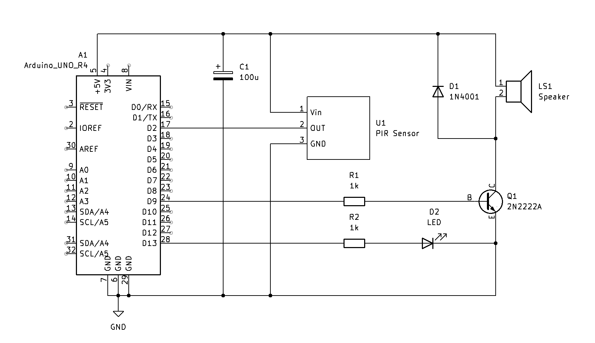

# Lesson 044: PIR Motion Security Alarm

## Project Info
- **Project Name:** PIR Motion Security Alarm
- **Lesson:** [Arduino Uno R4 WiFi LESSON 44: Playing Music On Your Arduino With a Passive Buzzer](https://www.youtube.com/watch?v=lK-tmgaWrLg&list=PLGs0VKk2DiYyn0wN335MXpbi3PRJTMmex&index=46) by Paul McWhorter
- **Revision:** 1.2 (Final Version)
- **Date:** 2026-03-11
- **Author:** SuperMechatronicEngineer

## Project Description
This project demonstrates a robust, event-driven security system using the **Arduino UNO R4**. The system is designed around a **PIR (Passive Infrared) sensor** that, upon detecting motion, triggers a synchronized alert sequence: a high-decibel **bitonal siren** via a passive buzzer and a **visual red LED warning**.

To ensure signal integrity, the system implements a **software-defined debounce period**. This 100ms lockout immediately following the siren sequence serves to filter out potential electrical transients caused by the buzzer's current draw. By decoupling the detection cycles, the firmware prevents false re-triggering and ensures that the Serial Monitor reports only legitimate motion events.

Because hobbyist PIR modules often exhibit instability during power-up, the firmware features a mandatory **10s Infrared Calibration phase**. This startup delay allows the sensor's pyroelectric element to reach thermal equilibrium, establishing a reliable baseline for infrared detection and preventing erroneous triggers during the stabilization period.

## 📺 Video Documentation
The complete build and demonstration are available on Odysee:
- **Watch here:** [Arduino UNO R4 WiFi - PIR Motion Security Alarm](https://odysee.com/@SuperMechatronicEngineer:8/044-PIR-Buzzer:a)

## Technical Details
* **Hardware:** Arduino UNO R4 WiFi, **HC-SR501 PIR Sensor (Pin 2)**, **2N2222A NPN Transistor (Pin 9)**, 16Ω Passive Buzzer, **1x Red LED (Pin 12)**.
* **Power Management:** The breadboard is powered directly via the **5V rail** from the Arduino, with a **common ground (GND)** shared across all components to ensure a stable reference and return path.
* **Power & Signal Integrity:** Includes a **100µF electrolytic capacitor** and a **1N4001 flyback diode** to protect the microcontroller from back-EMF spikes and voltage drops during the high-current siren activation.
* **Memory Optimization:** All constants are defined using `constexpr uint8_t` to minimize RAM footprint and maximize execution speed on the 8-bit registers.
* **Flash Storage:** Implements the `F()` macro for all Serial strings, forcing static text to remain in Flash memory and leaving the SRAM free for dynamic operations.
* **Event-Driven Telemetry:** Serial data (**115200 baud**) is only sent when motion is detected, keeping the log clean and readable.

## Software Logic & Architecture
* **Calibration Loop:** A dedicated `setup()` sequence provides real-time countdown feedback via Serial, ensuring the system is only armed once the PIR sensor signal has stabilized.
* **Siren Algorithm (Pin 9):** Uses a frequency-alternating loop (1.5kHz and 0.8kHz) to create a high-visibility acoustic alert, driven through a transistor-buffered PWM output to handle the buzzer's current requirements.
* **Visual Feedback (Pin 12):** A dedicated LED output provides immediate visual confirmation of the alert state, synchronized with the acoustic siren.
* **Noise Mitigation:** A strategic `delay(100)` is implemented post-alert to act as a software noise gate, filtering out residual inductive noise that could otherwise cause a recursive trigger loop.

## Schematic

## License & Credits
- **Original Tutorial:** Paul McWhorter (TopTechBoy).
- **License:** This project is licensed under [CC BY-NC-SA 4.0](../../LICENSE) (Attribution-NonCommercial-ShareAlike).