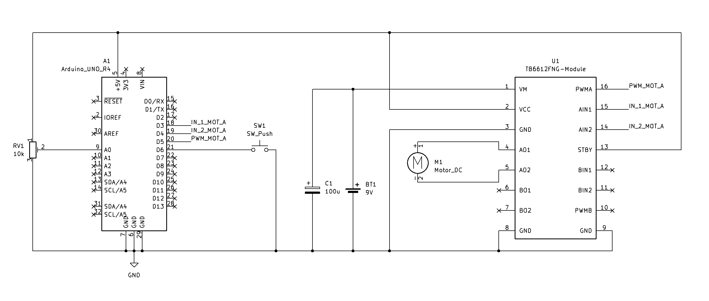

# Lesson 047: DC Motor Control using TB6612FNG

## Project Info
- **Project Name:** DC Motor Control using TB6612FNG
- **Lesson:** [Arduino Uno R4 WiFi LESSON 47: Bidirectional DC Motor Control With the TA6586 Motor Controller](https://www.youtube.com/watch?v=lvqnM10uWLU&list=PLGs0VKk2DiYyn0wN335MXpbi3PRJTMmex&index=54) by Paul McWhorter
- **Revision:** 1.2 (Final Version)
- **Date:** 2026-03-27
- **Author:** SuperMechatronicEngineer

## Project Description
This project explores a complete control system for a brushed DC motor using an **Arduino UNO R4 WiFi**. While the original lesson by Paul McWhorter utilized the TA6586 driver, this implementation upgrades the hardware to a **TB6612FNG breakout board**.

Although both chips utilize MOSFET technology, the **TB6612FNG** was chosen for its **superior efficiency** (lower $R_{DS(on)}$) and **versatile control logic**. Unlike the basic two-pin interface of the TA6586, the TB6612FNG features a dedicated Standby (STBY) pin and independent PWM/Phase inputs, allowing for more sophisticated power management and precise speed modulation.

The system focuses on handling real-world signals and power management in an educational mechatronics context. To ensure precise control, the firmware replaces the standard `map()` function with a **linear interpolation formula** ($y = mx + q$). This allows for manual calibration of the 10kΩ potentiometer, mapping the raw analog input directly to the R4's 10-bit PWM range (0-1023).

## 📺 Video Documentation
The complete build and demonstration are available on Odysee:
- **Watch here:** [Arduino UNO R4 WiFi - How to Control a DC Motor using TB6612FNG](https://odysee.com/@SuperMechatronicEngineer:8/047-DC-Motor-Control:2)

## Technical Details
* **Hardware:** Arduino UNO R4 WiFi, **TB6612FNG Breakout Board** (PWM: Pin 5, AI1: Pin 4, AI2: Pin 3), 10kΩ Linear Potentiometer (Pin A0), Momentary Push-button (Pin 6), Brushed DC Motor, 9V External Battery.
* **Power Management:** The logic circuit (potentiometer, button, and driver logic/standby) is powered by the **Arduino 5V pin**, while the motor is driven by a separate **9V battery**. All components share a **common ground (GND)** to ensure a stable reference and signal return path.
* **Stability & Protection:** A **100µF electrolytic capacitor** is connected in parallel with the 9V supply to buffer voltage sags during motor inrush. The firmware also includes **ADC signal conditioning** and pre-calculation clipping to keep the PWM output stable, preventing "jitter" caused by minor analog-to-digital conversion fluctuations.
* **Advanced Optimization:** Used `constexpr` for pin mapping to ensure compile-time optimization. High-speed Serial telemetry (**115200 baud**) provides real-time feedback on PWM duty cycle and rotation state.

### 🕹️ TB6612FNG Control Logic
The TB6612FNG is a **Dual H-Bridge driver** capable of controlling two independent DC motors (Channels A and B). For this project, **only Channel A is utilized**. The motor speed is regulated via **Pulse Width Modulation (PWM)** on the PWMA input.

| AI1 (Pin 4) | AI2 (Pin 3) | Mode | Description |
| :--- | :--- | :--- | :--- |
| **HIGH** | **LOW** | Clockwise | Normal rotation (Forward) |
| **LOW** | **HIGH** | Counterclockwise | Reverse rotation |
| **HIGH** | **HIGH** | Short Brake | Dynamic braking (Motor stops quickly) |
| **LOW** | **LOW** | Stop | Free coasting (Motor stops by inertia) |

*Note: The **STBY (Standby)** pin must be held **HIGH** for any operation. In this project, it is tied to the Arduino 5V rail.*

## Software Logic & Architecture
* **Linear Calibration:** Instead of standard scaling, the firmware calculates speed using the formula:
  $$potValue = (rawValue - POT_{MIN}) \cdot \frac{PWM_{MAX}}{POT_{MAX} - POT_{MIN}}$$
  This ensures the PWM output is perfectly aligned with the actual electrical range of the potentiometer (calibrated from 5 to 1015).
* **Interrupt-Based Preemption:** Direction toggling is handled via a **Hardware Interrupt (FALLING edge)** on Pin 6. This ensures the system reacts immediately to user input, bypassing the main loop execution for maximum responsiveness.
* **Protected Directional Switching:** The firmware manages rotation through a **dual-state logic (Forward/Reverse)** with an integrated **Safety Transition Phase**. Whenever a direction flip is triggered, the system enforces a 300ms "cool-down" window. During this interval, the PWM is overridden to zero using non-blocking `millis()` timing, allowing the motor's back-EMF to dissipate safely before the H-bridge reverses polarity. This prevents high-current transients and protects the MOSFETs from inductive spikes.

## Schematic

## License & Credits
- **Original Tutorial:** Paul McWhorter (TopTechBoy).
- **License:** This project is licensed under [CC BY-NC-SA 4.0](../../LICENSE) (Attribution-NonCommercial-ShareAlike).